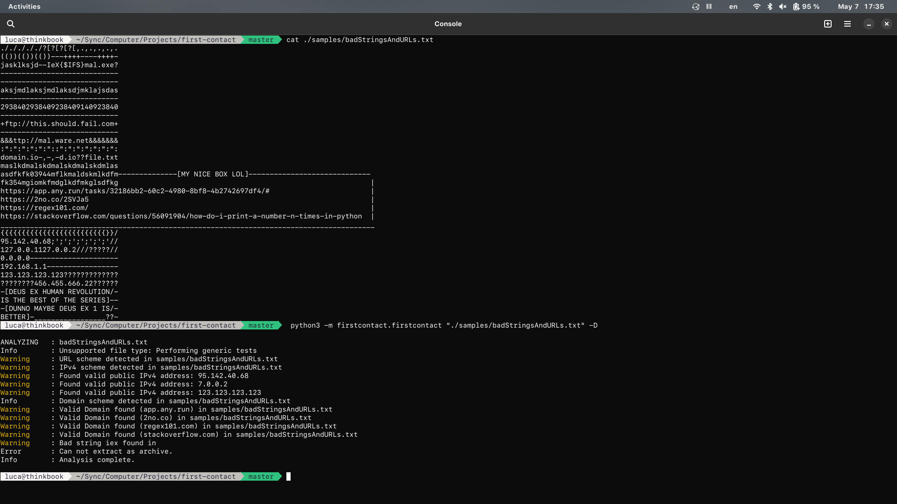
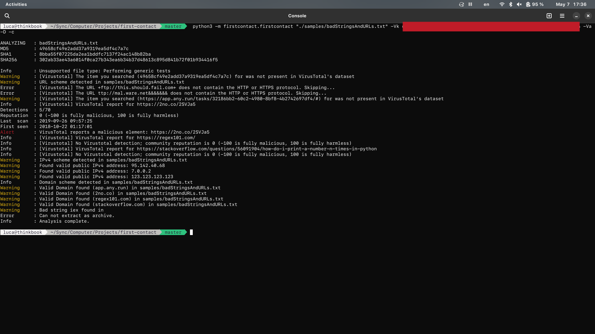
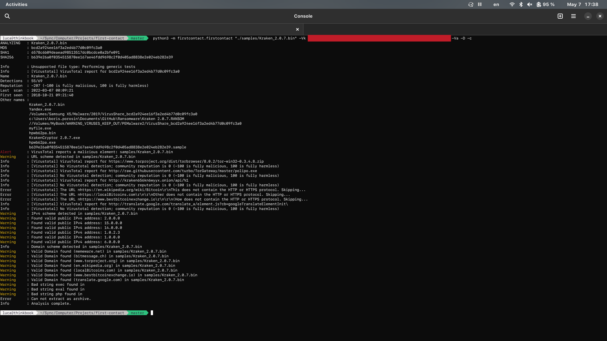
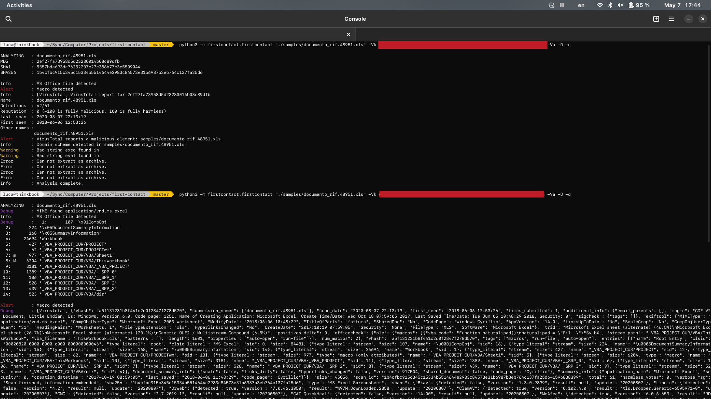

first-contact Copyright 2017, 2022 Luca Reggiannini

This program is free software distributed under the GNU General Public License.
You should have received a copy of the GNU General Public License
along with this program (see "LICENSE" file).  If not, see <http://www.gnu.org/licenses/>.

This file is part of the "first-contact" project.
Main repository: https://github.com/LucaReggiannini/first-contact

# first-contact project
This project contains a set of tools to show evidence of possible malware infection within some file types.
The purpose of this project is only to automate some standard and repetitive operations that are performed during the malware analysis for certain types of documents (search for interesting strings, network IOCs, reputation checks via VirusTotal etc.)
The analyzes on the files are performed through third-party tools: this program does not want to replace them.
The following tools are used:

pdf-parser: https://github.com/DidierStevens/DidierStevensSuite/blob/master/pdf-parser.py \
oledump: https://github.com/DidierStevens/DidierStevensSuite/blob/master/oledump.py \
rtfdump: https://github.com/DidierStevens/DidierStevensSuite/blob/master/rtfdump.py

These tools are not distributed with "first-contact" so they must be downloaded from the developer's website.

For more information: \
    https://github.com/DidierStevens/DidierStevensSuite

# Warning
This project is still in an early stage of its development and has been tested on a limited number of samples.
Test results may be inaccurate. Always double check to make sure your analyzes are correct.

# Installation
## 1. Install "firstcontact" package
```
git clone https://github.com/LucaReggiannini/first-contact.git
cd first-contact
pip install .
```
## 2. Download DidierStevensSuite tools
Download files: \
https://github.com/DidierStevens/DidierStevensSuite/blob/master/pdf-parser.py \
https://github.com/DidierStevens/DidierStevensSuite/blob/master/oledump.py \
https://github.com/DidierStevens/DidierStevensSuite/blob/master/rtfdump.py

and put them in your `PATH` environment variable.

## 3. Install "libmagic"
first-contact uses `python-magic`

To make `python-magic` work please run the following commands (based on your platform):

    Debian/Ubuntu : sudo apt-get install libmagic1
    Windows       : pip install python-magic-bin
    OSX Homebrew  : brew install libmagic
    OSX macports  : port install file

# Compatibility
Currently the oldest Python version supported is 3.6.0 (Dec. 23, 2016):
https://www.python.org/downloads/release/python-360/

Update: to increase backward compatibility with older versions of Python all forms of *Type Hints* (https://docs.python.org/3/library/typing.html) have been removed. Methods definitions that implemented Type Hints in the past are still visible (commented out) and will be consistent with the current definitions (in this way they can be used as "documentation" and in the future they can be re-implemented at any time).

# How to analyze files
The main tool you can use to analyze files is module "firstcontact.py" in the Python package "firstcontact"

```
first-contact

SYNOPSIS
    python3 -m firstcontact.firstcontact [OPTIONS...] [FILE]

DESCRIPTION
    Shows evidence of possible malware infection within some file types.
    The purpose of this program is only to automate some standard and repetitive operations that are performed during the malware analysis for certain types of documents (search for interesting strings, network IOCs, reputation checks via VirusTotal etc.)
    The analyzes on the files are performed through third-party tools: this program does not want to replace them.
    
    The following tools are used:
        pdf-parser: https://github.com/DidierStevens/DidierStevensSuite/blob/master/pdf-parser.py
        oledump: https://github.com/DidierStevens/DidierStevensSuite/blob/master/oledump.py
        rtfdump: https://github.com/DidierStevens/DidierStevensSuite/blob/master/rtfdump.py
    
    These tools are not distributed with "first-contact" so they must be downloaded from the developer's website.
    
    For more information:
        https://github.com/DidierStevens/DidierStevensSuite
    
    Please put every third party tools on your PATH environment variable in order to use "first-contact"
    
    Tests for MS Office files:
    1. Macro detection (via oledump)
    2. URLs, IPv4 and Domains detection
    3. Blacklisted strings detection 
    4. Extraction as archive with generic tests for every files extracted

    Tests for RTF files:
    1. Objects detection (via rtfdump)
    2. URLs, IPv4 and Domains detection
    3. Blacklisted strings detection 

    Tests for PDF files:
    1. JavaScript and Action tags (via pdf-parser)
    2. JBIG2, Flash, XFA forms and Acroform (via pdf-parser)
    3. URLs, IPv4 and Domains detection
    4. Blacklisted strings detection
    5. Detect unknown or obfuscated objects (a list of known object is in <package_path>/config/knownPdfObjects.cfg)

    Generic tests (for every other file type):
    1. URLs, IPv4 and Domains detection
    2. Blacklisted strings detection 
    3. Extraction as archive with generic tests for every files extracted
    4. Virustotal report for Files and URLs 

MESSAGES TYPE:
    The program will display various types of messages:

    - Alert   : information that indicates the discovery of active code or elements recognized as malicious within the file.
                It could indicate the presence of an infection.

    - Warning : information indicating that an interesting element was found in the file. 
                A more in-depth manual analysis is required.

    - Info    : useful information to understand what the program is doing

    - Verbose : more detailed information on the data extracted from the file.
                Useful for having a precise dump of information.

    - Debug   : information that does not relate to the analysis.
                Useful for analyzing errors and solving problems within the code.
                Shows HTTP Virustotal responses and the outputs of programs used for analysis.

URLS DETECTION
    Extracts URLs from a file using a regular expression.
    
    This Regex is based on a superficial interpretation of RFC1738 so it may not work on all types of data.
    For more information: 
        https://datatracker.ietf.org/doc/html/rfc1738)

    Matches <scheme>://<scheme-specific-part> (two "slashes" have been added to the RFC definition).
    Scheme names consist of letters "a"--"z" (case insensitive), digits, and the following characters:
        "+",
        ".",
        "-".
   
    Scheme specific part can be everything until a non safe character is matched (defined in RFC):
        "<",
        ">",
        "{",
        "}",
        "|",
        "\",
        "^",
        "[",
        "]",
        "`".
        
    Omitted safe character are:
        "%",
        "#"
        "~".
    (they can be used to obfuscate malicious payloads into working URLs)

    If you want some specific results to be excluded from the match, insert them in "<package_path>/config/whitelistUrls.cfg" (one per line).
    For example, put "https://raw.githubusercontent.com" to exclude it from URL pattern match (every match that CONTAINS this string will be excluded!).

DOMAIN DETECTION
    Extract all domains from a file using a regular expression.
    
    This Regex in based on a superficial interpretation of RFC1034 so it may not work on all types of data.
    For more information:
        https://www.ietf.org/rfc/rfc1034.txt,
        http://www.tcpipguide.com/free/t_DNSLabelsNamesandSyntaxRules.htm)
    
    Matches <label-N>.<label>.<tld>.
    Labels consists of letters "a"--"z" (case insensitive), digits, and the character "-"; maximum length is 63 chars.
    Labels are separated by the character "." (you can have N label where N is an infinite number).
    The last label must be followed by the TLD.
    The TLD consists of letters "a"--"z" (case insensitive), digits, and the character "-"; maximum length is 63 chars.
    Valid TLDs must be inserted in "<package_path>/config/tlds.cfg" (current list last updated on 26-04-2022).
    If a TLD is not in this config file the domain will not match (necessary to prevent most matches with filenames whose form is similar to that of a domain name).
    For a list of valid TLDs see:
        https://www.iana.org/domains/root/db

    Since this pattern can easily match some filenames or strings contained in binary files, domain search is disabled by default to avoid false positives.
    Use option "-D" or "--domains" to enable this function.
    
    Note: potentially invalid names are also shown to highlight the presence of a match in the file.
    This could indicate the presence of parts of names within the file (which could be recomposed by the malicious code at runtime).
    For example, consider an Excel sheet with two cells containing "mal" and "ware.com/exe.exe" respectively.
    A Macro will use their contents to reassemble the complete URL "malware.com/exe.exe" which was not initially detectable.
    Domain detection will still detect "ware.com" as a possible domain: this can be a very useful wake-up call.
    Once the regular expression is used, a "Warning" is shown only for RESOLVABLE domains.
    
    If you want some specific results to be excluded from the match, insert them in the "<package_path>/config/whitelistDomains.cfg" file (one per line).
    For example, put "raw.githubusercontent.com" to exclude it from URL pattern match.

IPV4 DETECTION
    Extracts IPv4 from a file using a regular expression.
    
    This Regex matches 4 groups of numbers consisting of three digits and separated by a period.
    This will also match invalid IPv4 like 999.123.120.288 so once the regular expression is used, a "Warning" is shown only for VALID IPs that appear to belong to the public network.
    
    Note: potentially invalid or private IPs are also shown to highlight the presence of a match in the file.
    There may be hidden data in the file next to the matched data that is excluded from the regex. 
    For example in the payload "foo192.168.1.95.142.40.68bar", due to the structure of the Regex, only "192.168.1.95" is matched and not "95.142.40.68".
    This valid (potentially malicious) public IP can only be detected by examining the content of the file manually.

    If you want some specific results to be excluded from the match, insert them in the "<package_path>/config/whitelistIpv4.cfg" file (one per line).
    For example, put "127.0.0.1" to exclude it from IPv4 pattern match.

BLACKLISTED STRINGS DETECTION
    Simply searches bad strings (case insensitive) previously entered in the "<package_path>/config/blacklist.cfg" (one per line).

NOTES ON PATTERNS DETECTION
    Every detections system based on strings or Regex will NOT detect split IOC.
    For example an URL split in various Excel Sheets and "re-assembled" runtime by an Excel 4.0 Macro will NOT be detected.
    
    Remember that matches are case insensitive: if first-contact reports that it found the string "powershell", the file may also contain, for example, the string "pOwErShElL".
    Keep this in mind when doing a second manual analysis on files.

NOTES ON VIRUSTOTAL REPORTS
    Domain and IP reports are not implemented because: "Unlike file and URL reports, network location views do not record partner verdicts for the resource under consideration. Instead, these reports condense all of the recent activity that VirusTotal has seen for the resource under consideration, as well as contextual information about it."
    Source:
        https://support.virustotal.com/hc/en-us/articles/115002719069-Reports#h_c095fe17-40ce-4a5d-a561-6df598cf34d6

OPTIONS
    -h, --help 
        show this manual

    -v, --verbose 
        show more informations during execution

    -d, --debug
        show debugging informations (VirusTotal HTTP responses and complete file test results)

    -c, --checksum
        Calculate file MD5, SHA1 and SHA256

    -D, --domains
        Enable Domains detection

    -m, --mime [MIME]
        Set file MIME manually.
        Automatic MIME detection will be ignored

    -k, --keep-after-extraction
        Do not delete extracted archives content after analysis.
        Archive content is extracted in <tmp>/first-contact/<archive-name>

    -Vk, --virustotal-api-key [API_KEY]
        Required for any data from Virustotal

    -Vf, --virustotal--file-report
        Get VirusTotal report for given [FILE].
        If the file it's not already submitted no data will be uploaded

    -Vu, --virustotal--url-report
        Get VirusTotal report for every URL detected in [FILE].
        If the URL it's not already submitted no data will be uploaded
        The URL must contain HTTP/S protocol

    -Va, --virustotal-all-report
        Get VirusTotal report for given [FILE] and all URL detected inside it.
        If an element it's not already submitted no data will be uploaded.
        Equivalent to options -Vf and -Vu used together

    -Vun, --virustotal-unlimited-names
        In the VirusTotal report shows all the names with which the file has been submitted or seen in the wild.
        If this option is not activated the limit is 10 names.

```

# What the rest of the package contains
The package contains general module that you can integrate into your custom scripts.

`out`: contains functions for the output (distinction by type of message, colored output etc.) \
`tests`: contains functions to perform tests on files (search for patterns within files, active objects in RTF files, extraction of archives etc.) \
`utils`: contains generic functions (hash calculation, file opening, MIME detection etc.) \
`vt`: contains functions to get reports from Virustotal

For further information refer to the comments in the code of the various modules

# Screenshots

Example of analysis (file content + results):


Same analysis with VirusTotal report:


Example with an executable file:


Example with a maldoc:

